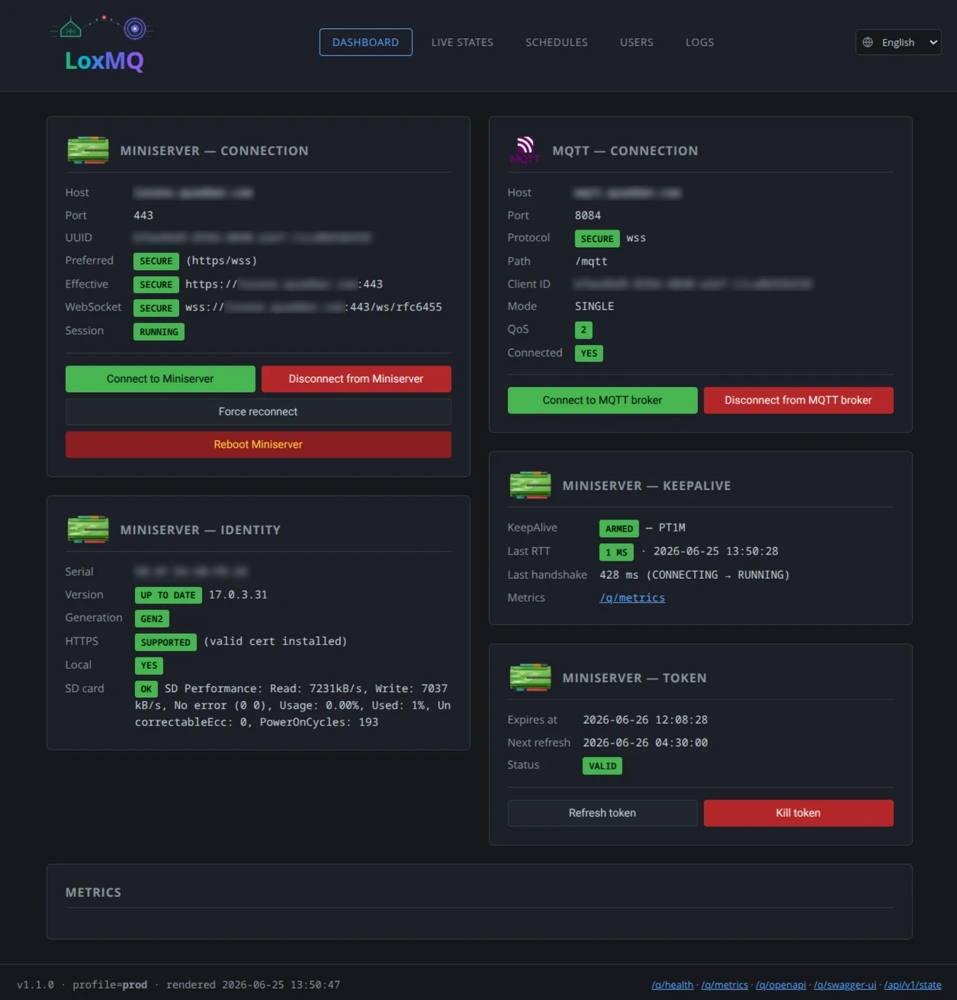
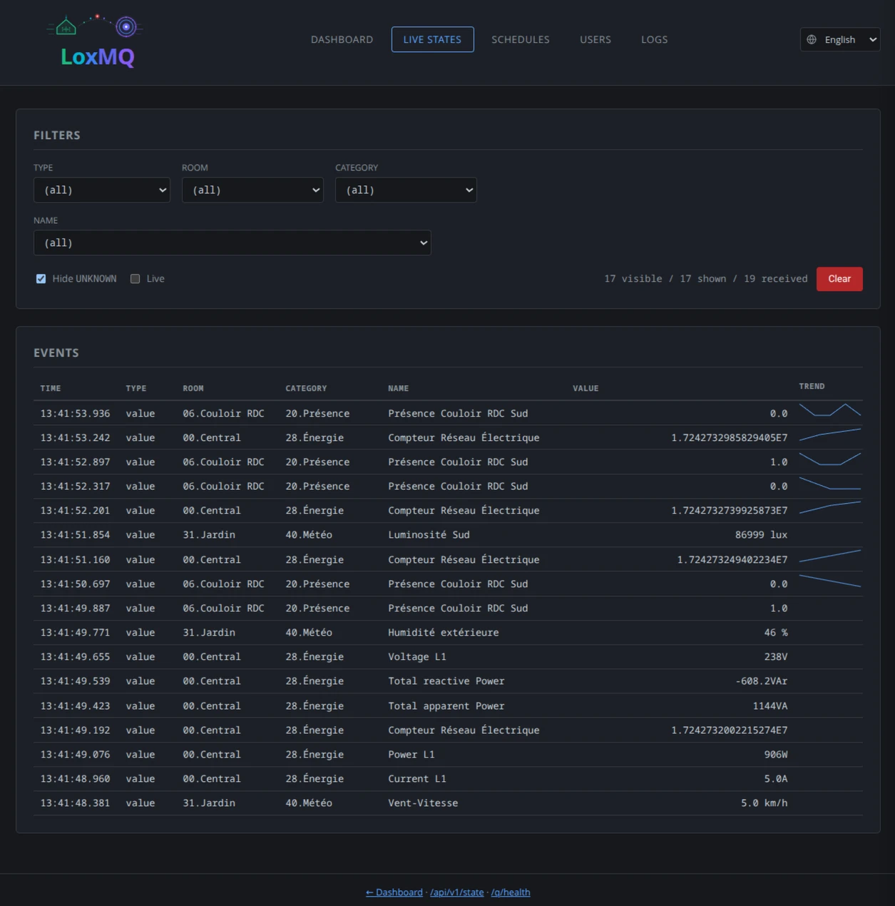
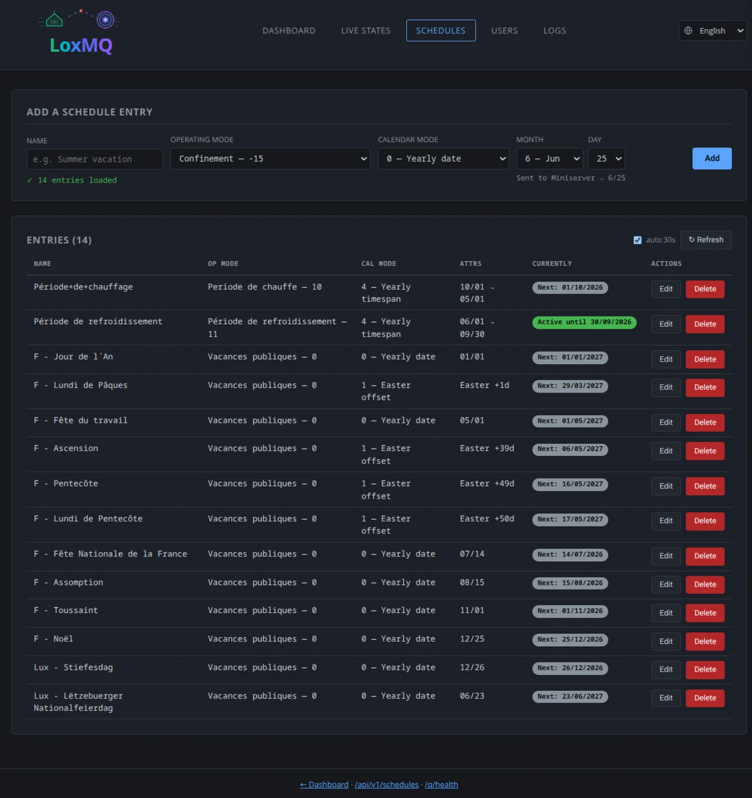
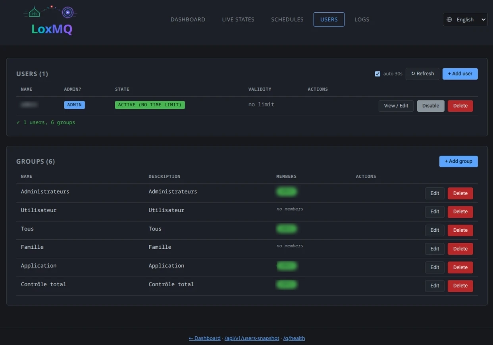
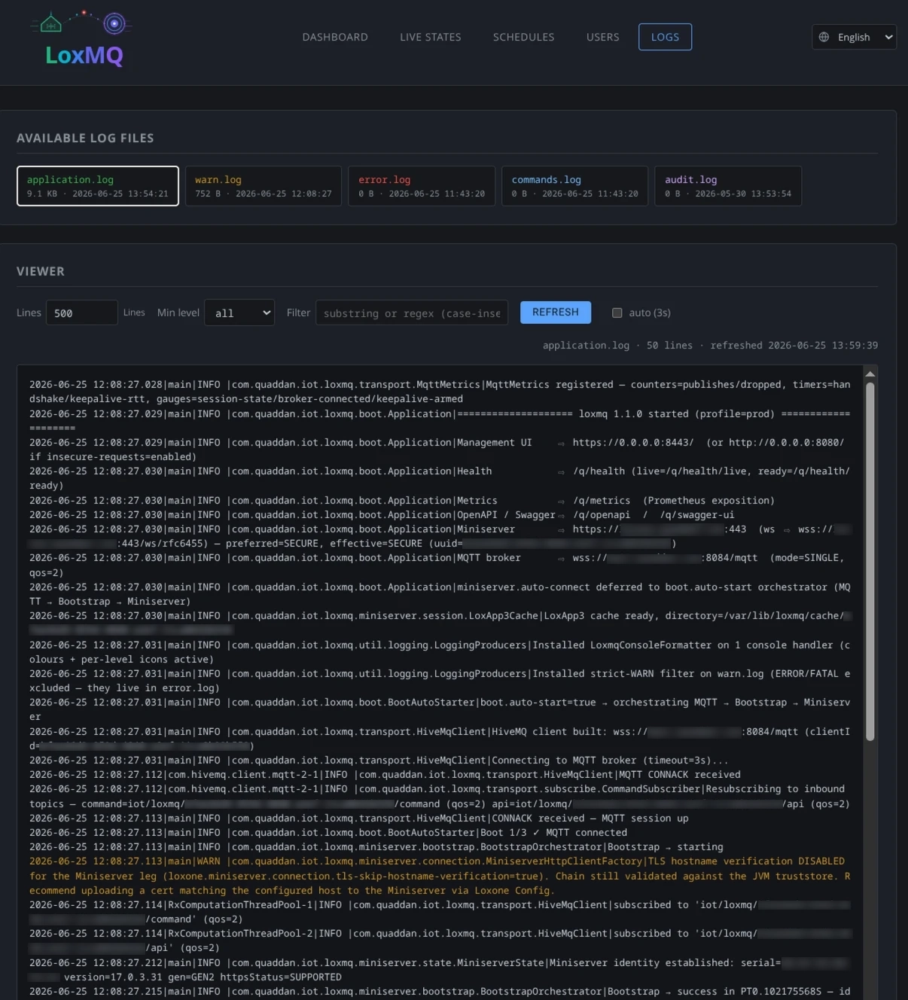

[](https://github.com/quaddan/loxmq/actions/workflows/ci.yml)
[](https://hub.docker.com/r/quaddan/loxmq)
[](LICENSE)
[](https://openjdk.org/projects/jdk/25/)
[](https://quarkus.io)
[](https://docs.oasis-open.org/mqtt/mqtt/v5.0/mqtt-v5.0.html)

# Production-grade bridge between a Loxone Miniserver and an MQTT v5 broker.

Designed to easily connect a Loxone Miniserver to Home Assistant or any other
MQTT consumer.

1. Decodes Loxone Miniserver states in real time.
2. Republishes them on an MQTT v5 broker.
3. Routes inbound MQTT commands back to the Miniserver.
4. Exposes a **responsive** web admin interface:
    - Dashboard (Miniserver Loxone and MQTT server connection infos and state).
    - Users and groups administration.
    - Schedules.
    - Application logs.
    - Check SD card health.
    - Check if latest firmware is installed.

---

## Professional-grade — because it runs the place you live

Home automation is **NOT a toy**.   
When software controls the lights, heating, access and blinds of a real home, *"mostly working"* is not
good enough — it has to be there every single day, silently, the way a fuse box is.   
**`loxmq` is engineered as infrastructure**: install it once, and it just stays up.

### Built to run 24/7, unattended.

- Every failure mode is handled on purpose — encrypted-session loss, JWT expiry, broker outage, Miniserver reboot.
- The bridge reconnects by itself with exponential backoff + jitter, refreshes its tokens before they expire, keeps the link warm with measured-RTT keep-alives, and continuously reports its
  own health.
- A transient glitch heals itself instead of becoming a 3 a.m. manual intervention.

### Compiled to a native binary

- Near-instant start, minimal footprint.

- Through GraalVM / Mandrel ahead-of-time compilation, the production build is a single self-contained executable that **boots in ~50 ms** and lives in **50-80 MB of RAM** — no JVM warm-up, no container required.
- It restarts in the blink of an eye and leaves your home server's resources to your home.

### Security taken seriously, continuously.

- The dependency tree is regularly audited (Trivy + OWASP Dependency-Check — methodology in
  [SECURITY.md](./SECURITY.md)); when a vulnerability appears, the fix is developed and shipped as a priority. Credentials never live in the repository or in the binary, the inbound MQTT surface is hardened
  against replay and oversized payloads, and the attack surface is kept
  deliberately small.

### A real admin interface — not just a config file.

- A clean, multilingual web UI (FR / EN / DE) lets you watch Miniserver states
  stream in live, manage users and groups, edit operating-mode schedules, and read the server logs — straight from the browser, with no Loxone Config round-trip. Underneath, a full REST API and
  Prometheus metrics are there whenever you want to automate or integrate.

## The result

<span style="color:orange; font-weight:bold">The dependability of an appliance, the transparency of
open source, and the comfort of a polished UI</span>
— for the one system in your house you cannot afford to have flaky.

---

## Why loxmq

Loxone is a proprietary home-automation system with an encrypted
WebSocket protocol that is hard to plug directly into open-source
home-automation tools. **`loxmq` bridges the gap**:

```
┌──────────────────┐   encrypted WebSocket    ┌─────────┐    MQTT v5     ┌────────────────┐
│ Loxone Miniserver│ ◄─── RSA + AES + JWT ───►│  loxmq  │ ◄─────────────►│ MQTT broker    │
│  (LAN)           │     binary               │         │   topics       │ (Mosquitto, …) │
└──────────────────┘     event-tables         └─────────┘                └────────────────┘
                                                                                  │
                                                                                  ▼
                                                                         ┌────────────────┐
                                                                         │ Home Assistant │
                                                                         │ Node-RED, …    │
                                                                         └────────────────┘
```

> **Both links are securable with TLS.** The Miniserver link is an
> encrypted WebSocket that negotiates `https` / `wss` automatically
> (see *Miniserver connection — "secure" mode* below). The broker link
> carries **MQTT v5 over WebSocket** (`ws`, path `/mqtt`) and is upgraded
> to `wss` when `loxone.transport.connection.secure=true`.

### Capabilities

- **Binary event-table decoding** for Loxone (Value / Text / DayTimer /
  Weather) and republishing on readable MQTT topics.
- **Routing of MQTT commands** to the Miniserver (RSA + AES
  encryption + send on the WebSocket).
- **Automatic reconnection** of both live links after a disconnect or
  network outage: the Miniserver WebSocket is rebuilt by a dedicated
  retry scheduler, the MQTT broker link by HiveMQ auto-reconnect
  (exponential backoff) — no operator action required.
- **Full management of Miniserver users and groups** (CRUD)
  via a REST API and a web UI — without going through Loxone Config.
- **Schedule management** (calMode 0-5: annual date, Easter offset,
  specific period, annual period, day of week).
- **SD-card health check**: the Miniserver's on-device SD-card
  self-test (`jdev/sys/sdtest`) runs once per session; the dashboard
  shows OK / ERROR plus the read/write throughput and usage report.
- **Latest firmware version check.**
- **Native observability**: real-time dashboard, Prometheus metrics,
  MicroProfile health checks, structured logs.
- **Industrialisable deployment**: standalone native binary
  (~88 MB, ~50 ms startup), systemd units, bootstrap / deploy scripts.

Designed to run **24/7** (LXC Proxmox + systemd recommended).

---

## Screenshots

The management web UI — multilingual (FR / EN / DE), plain HTTP in dev and
HTTPS in staging/prod. Personal data (Miniserver host, UUID, serial, LAN
address, and user / room / control names) is blurred in these captures.

**Dashboard** (`/`) — Miniserver & MQTT connection, identity, keepalive, token.



**Live states** (`/states`) — real-time decoded states, filterable by type / room / category / name.



**Schedules** (`/schedules`) — the Miniserver operating-mode calendar (full CRUD).



**Users** (`/users`) — users & groups audit and guarded management.



**Logs** (`/logs`) — log-file viewer with severity filter and live tail.



---

## Quick start

> For a complete, linear install guide — configuration plus build & run for
> both the JVM fast-jar and the native binary — see **[INSTALL.md](./INSTALL.md)**.

### Prerequisites

- **JDK 25 LTS** (the build is pinned to `--release=25`; the host JDK
  may be newer — see `NATIVE.md` for the native-image caveat).
- **Maven 3.9+**.
- **Docker** (optional — only for the native build via Mandrel and
  for the integration tests against a Mosquitto container).

### Build

```bash
git clone https://github.com/quaddan/loxmq.git
cd loxmq
./mvnw -DskipTests package
```

The build is hermetic — it does **not** require any environment
variable. Credentials are only needed at runtime, not at build time.

### Run in dev mode

```bash
cp .env.example .env
# edit .env with your Base64-encoded credentials (see note below), then:
source .env
./mvnw quarkus:dev
```

> **Credentials are read Base64-encoded.** All four secrets — Miniserver
> user / password and MQTT broker user / password — are expected
> Base64-wrapped in the environment and decoded once at startup (at-rest
> obfuscation, **not** encryption). Encode each value with
> `echo -n 'my_secret' | base64`. The exact variable names live in
> [`.env.example`](./.env.example).

Dashboard at `http://localhost:8080/`. The `dev` profile is implicit
and enables live-reload + Swagger UI at `/q/swagger-ui`.

### Run the tests

```bash
./mvnw test                                 # unit, in-JVM,        ~10 s
./mvnw verify -Pintegration                 # + IT against packaged JAR + Mosquitto Testcontainer, ~2 min
./mvnw verify -Pnative,integration          # + native binary IT,  ~10 min (requires Docker)
```

See [`CONTRIBUTING.md`](./CONTRIBUTING.md) for the contributor workflow and
[`TESTS.md`](./TESTS.md) for the full test strategy.

### Run in production

```bash
./mvnw -DskipTests package
java -Dquarkus.profile=prod -jar target/quarkus-app/quarkus-run.jar
```

In production the bridge runs as a **systemd service** from one of two
mutually exclusive units — `loxmq-jvm.service` (fast-jar) or
`loxmq-native.service` (native binary), both shipped under
[`service/`](./service/). The end-to-end deployment walkthrough is in
**[INSTALL.md §7](./INSTALL.md#7-deploy-to-production)**; the LXC bootstrap /
release scripts that automate it are operator-specific and stay out of the
public repository.

### Run with Docker (no Java toolchain needed)

Pre-built images are published on Docker Hub at
**[`quaddan/loxmq`](https://hub.docker.com/r/quaddan/loxmq)** — `:jvm`
(multi-arch incl. ARM, also `:latest`) and `:native` (x86-64). Pull and run
with Compose; you only configure `.env`, drop your TLS cert in `./certs`, and
read the logs:

```bash
cp .env.example .env                                   # edit hosts/creds/app id
mkdir -p certs logs cache config                       # cert + key → ./certs
docker compose -f docker-compose.published.yml up -d
```

Full walkthrough — configuration, certificates, logs, updates — in
**[`docker/README.md`](./docker/README.md)**.

---

## Platform support

**The target platform is Linux (x86-64).** This is a deliberate choice for
a 24/7, always-on service: the bridge is designed around Linux-native
operational primitives — `systemd` supervision (auto-start,
restart-on-failure, boot ordering), the systemd hardening sandbox
(`ProtectSystem=strict`, `NoNewPrivileges`, `DynamicUser`, …), the
GraalVM **native ELF** binary (~50 ms start, 50-80 MB RSS), and an
LXC/Proxmox + Let's Encrypt / certbot deployment model. The recommended
production setup is the native binary under a `systemd` unit.

**It can also run on Windows** (or macOS): the application code itself is
OS-agnostic — portable `java.nio` paths, explicit UTF-8, no POSIX-only
system calls, no shelling out to external processes. Only the *packaging
and operations* are Linux-oriented, so a Windows host runs the **JVM
fast-jar** fine once these adjustments are made:

| # | Topic                         | Adjustment on Windows                                                                                                                                                                                                                                                                                                                                                         |
|---|-------------------------------|-------------------------------------------------------------------------------------------------------------------------------------------------------------------------------------------------------------------------------------------------------------------------------------------------------------------------------------------------------------------------------|
| 1 | **Run mode**                  | Use the **JVM fast-jar** — `java -Dquarkus.profile=prod -jar target/quarkus-app/quarkus-run.jar`. The native binary is compiled per-OS and is shipped/tested here as a **Linux ELF**; a Windows-native `.exe` would require a Windows GraalVM / Mandrel distribution **plus** the MSVC toolchain (Visual Studio Build Tools). The same fast-jar runs unchanged on any JRE 25. |
| 2 | **Directories**               | Point `LOG_DIR`, `CACHE_DIR` (and `LOXONE_CERT_DIR` when TLS is enabled) at Windows paths, e.g. `C:\ProgramData\loxmq\{logs,cache,certs}`. The relative defaults (`logs`, `cache`) also work — they resolve under the process working directory.                                                                                                                              |
| 3 | **Service supervision**       | There is no `systemd`. Wrap the fast-jar as a **Windows Service** with [WinSW](https://github.com/winsw/winsw) or NSSM to get auto-start, restart-on-failure and `stdout`→file redirection (the systemd-unit equivalents).                                                                                                                                                    |
| 4 | **TLS certificates**          | Supply `fullchain.pem` + `privkey.pem` in `LOXONE_CERT_DIR`. Replace the certbot + rsync model with **win-acme (WACS)** or a manual copy; the `reload-period` hot-reload behaves identically.                                                                                                                                                                                 |
| 5 | **Logs / observability**      | No `journalctl`. Read the rotated files under `LOG_DIR` (`application.log`, `error.log`, `warn.log`) or the built-in **`/logs`** page, or rely on the service wrapper's log redirection.                                                                                                                                                                                      |
| 6 | **Build & test** *(optional)* | Use `mvnw.cmd`. Unit tests (`mvnw.cmd test`) need nothing extra; the Mosquitto **integration** tests (`-Pintegration`) need a container engine — Docker Desktop, Podman or WSL2.                                                                                                                                                                                              |

In short: **Linux is the supported, battle-tested target; Windows is a
viable alternative for the JVM fast-jar** once the six points above are
handled.

---

## Project status

| Aspect               | Value                                                                                                                                                                                                                  |
|----------------------|------------------------------------------------------------------------------------------------------------------------------------------------------------------------------------------------------------------------|
| Version              | **1.1.0** — see [CHANGELOG.md](./CHANGELOG.md)                                                                                                                                                                         |
| Stack                | Java 25 LTS · Quarkus 3.37.0 · `quarkus-hivemq-client` 2.5.0 (Quarkiverse, native-friendly) · Hibernate Validator · Qute · Micrometer / Prometheus                                                                     |
| MicroProfile         | Health · Metrics (Micrometer) · OpenAPI · Fault Tolerance · Config                                                                                                                                                     |
| TLS                  | Wildcard `*.<domain>` Let's Encrypt on the binding's HTTP server side. On the Miniserver side: automatic resolution based on `httpsStatus` returned by `jdev/cfg/apiKey` (transparent plain/secure switch).            |
| Packaging            | **JVM fast-jar** (~2 s startup) + **native binary** (~88 MB, ~50 ms startup, 50-80 MB RSS, standalone) + **two mutually exclusive systemd units** `loxmq-jvm.service` / `loxmq-native.service` (recommended for prod). |
| Internationalisation | Multilingual UI **FR / EN / DE** with combobox in the header. Automatic detection on `navigator.language`, override persisted in `localStorage`.                                                                       |
| Responsive           | All five pages (dashboard, states, schedules, users, logs) adapt to phones and narrow desktop windows — collapsing grids, scrollable tab bar and tables, no horizontal overflow (`css/mobile.css`).                    |
| Tests                | Unit tests (`./mvnw test`) + Integration tests (`./mvnw verify -Pintegration`) against packaged artifact, including Testcontainers Mosquitto.                                                                          |

---

## What loxmq does in detail

### 1. Miniserver connection

- **WebSocket** to `{ws|wss}://<miniserver-host>:<port>/ws/rfc6455`
  (configurable via `loxone.miniserver.connection.{host,port,secure}`).
- **Encrypted handshake**: RSA-OAEP + AES-CBC + JWT tokens (see Loxone
  spec *Communicating with the Miniserver* §Authentication).
- **Dynamic resolution** of `ws` vs `wss` scheme: `ConnectionModeResolver`
  reads `httpsStatus` returned by `jdev/cfg/apiKey` and switches
  automatically if the TLS cert is not (yet) installed on the
  Miniserver. Knob `bootstrap-prefer-secure=true` to force HTTPS
  from the first call.
- **JWT tokens**: automatic refresh every 24 h, `killtoken` at
  shutdown, management of rights `4095` (bitmask user-mgmt + op-modes
    + visu).
- **Keep-alive** with RTT measurement (Micrometer timer).
- **Reconnect** with exponential backoff + jitter, policy per
  Loxone close-code (4003-4008).

### 2. Decoding and republishing

- **Binary event-tables**: Value (8 bytes float64), Text (UTF-8
  length-prefixed padding 4 bytes), DayTimer (day/hour entries),
  Weather (variable). Little-endian format conforming to V17.0 spec
  §Message Header p. 18.
- **MQTT transport**: MQTT v5 carried over **WebSocket** by default
  (`loxone.transport.connection.protocol=ws`, path `/mqtt`); the
  orthogonal `secure=true` flag upgrades `ws → wss` (TLS). A raw `tcp`
  family is also accepted (`tcp` / `ssl`). Typical ports: `8083` (ws) /
  `8084` (wss) / `1883` (tcp) / `8883` (ssl).
- **MQTT republishing**: one topic per decoded state, derived from the
  Loxone UUID + type. `SINGLE` mode (one message per state, low
  latency) or `BATCH` (one aggregated message, low broker throughput).
- **Configurable topic root**; default `iot/loxmq/<uuid>/…`.
- **LWT will message** on `…/status` with `retained=true` —
  `online` at boot, `offline` on clean shutdown, `offline`
  automatically if the MQTT TCP crashes.

### 3. Inbound commands

- **Subscribe** to topics `…/command` (Loxone controls) and `…/api`
  (admin commands) at each MQTT CONNACK.
- **RSA + AES encryption** of each command then send on the
  Miniserver WebSocket.
- **Response routing**: the Miniserver's reply text frame is
  republished on `…/command_response` with UUID correlation.
- **Inbound security**: drop messages `retained=true` (avoids
  replay on CONNACK), cap payload size 4 KB.

### 4. Administration

- **REST API** `/api/v1/*` for CRUD users / groups /
  schedules. See endpoint table below.
- **Web UI**: dashboard + pages `/states` (live), `/schedules`,
  `/users`, `/logs`. Vanilla JS (no framework) + HTMX + Qute.
- **Responsive**: all five pages adapt to phones and narrow desktop
  windows — collapsing grids, scrollable tab bar, every wide table in a
  horizontally scrollable frame, no viewport overflow (`css/mobile.css`).
- **Auto-refresh 30 s** + Server-Sent Events
  `/api/v1/state/stream` for instant reload on session/MQTT
  transitions.
- **Full FR / EN / DE i18n** (header combobox, localStorage
  persistence, dynamic JS re-render on change). Scope is the **web UI
  only**: Miniserver runtime data (entry / room / cat names, UUIDs, JSON
  values) is passed through untranslated, and server-side output (logs,
  REST responses, error messages) stays in English.

### 5. Observability

- **Dashboard**: Miniserver sections (config / identity incl. SD-card
  health and **firmware up-to-date** badge / token incl. **next-refresh**
  timestamp / keepalive / actions), MQTT (config / actions), session state
    + bootstrap status live. Coloured badges throughout — PLAIN/SECURE per
      connection, QoS level, Local.
- **MicroProfile Health**: `/q/health/live` (process up),
  `/q/health/ready` (Miniserver session + broker connected).
- **Prometheus**: `/q/metrics` — counters publishes/drops/reconnects,
  gauges session state / broker, timers handshake / RTT keepalive.
- **Logs**: xterm-256 color console format + emojis per level,
  rotation by date + auto-purge 30 d, separate files
  `application.log` / `commands.log` / `error.log` / `warn.log`.

---

## Exposed endpoints

### HTML pages

| Path         | What                                                                                               |
|--------------|----------------------------------------------------------------------------------------------------|
| `/`          | Dashboard — Miniserver + broker + bootstrap + health state                                         |
| `/states`    | Live states in real time — SSE table + cascade dropdowns + per-UUID sparklines                     |
| `/schedules` | Operating-mode calendar CRUD — 5 calModes (annual date / Easter / specific / annual / day of week) |
| `/users`     | Miniserver users + groups — full CRUD — table + 5-tab detail modal                                 |
| `/logs`      | Server log viewer — min-level filter + auto-refresh + smart scroll                                 |

### REST `/api/v1/*`

| Path                           | What                                                              |
|--------------------------------|-------------------------------------------------------------------|
| `/api/v1/state`                | GET — JSON snapshot of state (config + runtime)                   |
| `/api/v1/state/stream`         | GET — Server-Sent Events (session / MQTT transitions)             |
| `/api/v1/bootstrap`            | POST — load public key + miniserver identity                      |
| `/api/v1/connect`              | POST — opens the WS session + handshake up to RUNNING             |
| `/api/v1/disconnect`           | POST — closes the WS session cleanly                              |
| `/api/v1/reconnect`            | POST — forces a reconnect to the Miniserver                       |
| `/api/v1/token/refresh`        | POST — refresh the JWT in place                                   |
| `/api/v1/token/kill`           | POST — invalidates the JWT and resets the session                 |
| `/api/v1/transport/connect`    | POST — connects the MQTT client, publishes `online` on `…/status` |
| `/api/v1/transport/disconnect` | POST — publishes `offline` then closes                            |
| `/api/v1/schedules`            | GET / POST / PUT / DELETE — calendar schedules CRUD               |
| `/api/v1/users`                | GET / POST — list + create user                                   |
| `/api/v1/users/{uuid}`         | GET / PUT / DELETE — detail + patch metadata + delete             |
| `/api/v1/users-snapshot`       | GET — UI helper: users + groups in one fetch                      |
| `/api/v1/users/{uuid}/disable` | POST — disable (`userState=1`)                                    |
| `/api/v1/users/{u}/groups/{g}` | POST / DELETE — assign / remove user from a group                 |
| `/api/v1/users/{uuid}/auth/*`  | POST — change password / visu-password / access-code              |
| `/api/v1/users/{uuid}/nfc`     | POST / DELETE — assign / remove NFC tag                           |
| `/api/v1/groups`               | GET / POST — list + create group                                  |
| `/api/v1/groups/{uuid}`        | PUT / DELETE — patch metadata + delete group                      |

### Platform

| Path              | What                                             |
|-------------------|--------------------------------------------------|
| `/q/health`       | Aggregated MicroProfile Health                   |
| `/q/health/live`  | Liveness probe (process alive)                   |
| `/q/health/ready` | Readiness probe (Miniserver session + broker OK) |
| `/q/metrics`      | Prometheus exposition                            |
| `/q/openapi`      | OpenAPI 3 schema (YAML)                          |
| `/q/swagger-ui`   | Swagger UI (enabled in dev/staging/prod)         |

---

## Miniserver connection — "secure" mode

`loxone.miniserver.connection.secure` is an **operator preference**,
not an absolute toggle. The effective resolution depends on the hardware
detected on the Miniserver side (Gen1 vs Gen2) and the state of the TLS
certificate (installed / expired / absent). The binding reads
`httpsStatus` returned by `jdev/cfg/apiKey` to decide.

| `config.secure` | Miniserver identity  | `httpsStatus` | Effective  | Operator comment                                                                  |
|:---------------:|:--------------------:|:-------------:|:----------:|:----------------------------------------------------------------------------------|
|     `false`     |         any          |      any      | **PLAIN**  | http + ws, always. Explicit choice.                                               |
|     `true`      |   not yet detected   |       —       |   PLAIN    | Bootstrap must go through HTTP first. Re-resolved after the identification phase. |
|     `true`      |  Gen2 + valid cert   |      `1`      | **SECURE** | https + wss, target production mode.                                              |
|     `true`      |    Gen1 (no TLS)     |    absent     |   PLAIN    | Gen1 has no TLS hardware support. Automatic downgrade + WARN log.                 |
|     `true`      | Gen2 + expired cert  |      `2`      |   PLAIN    | Reinstall the cert via Loxone Config.                                             |
|     `true`      | Gen2 + unknown value |     other     |   PLAIN    | Defensive. Report the raw `httpsStatus`.                                          |

**Practical case**: as long as the certificate is **not installed** on the
Miniserver, keep `loxone.miniserver.connection.secure=false` (or
leave `secure=true` — the binding will detect and downgrade cleanly).
Once the cert is installed via Loxone Config, the next bootstrap
returns `httpsStatus=1` → automatic switch to https/wss on the next
reconnect. No binding restart needed.

The dashboard, `/api/v1/state` and `/q/health/ready` expose the
fields `preferredMode`, `effectiveMode` and `downgradeReason` for
diagnostics.

---

## Maven and Quarkus profiles

| Profile             | Activation                      | Behaviour                                                   |
|---------------------|---------------------------------|-------------------------------------------------------------|
| `dev`               | `./mvnw quarkus:dev` (implicit) | plain HTTP, verbose logs, Swagger UI open, live-reload      |
| `staging`           | `-Dquarkus.profile=staging`     | HTTPS via wildcard, JSON logs, Swagger UI open              |
| `prod`              | `-Dquarkus.profile=prod`        | HTTPS only, JSON logs, Swagger UI open, HTTP→HTTPS redirect |
| `test`              | auto (`./mvnw test`)            | Mosquitto mocks + fake miniserver                           |
| Maven `integration` | `./mvnw verify -Pintegration`   | enables Failsafe ITs (`skipITs=false`)                      |
| Maven `native`      | `./mvnw package -Pnative`       | native image build via Mandrel / GraalVM                    |

---

## Documentation

- **[INSTALL.md](./INSTALL.md)** — from a fresh clone to a running bridge:
  configure, then build & run the **JVM fast-jar** or the **native
  binary**, with a health-check checklist.
- **[ARCHITECTURE.md](./ARCHITECTURE.md)** — design decisions,
  package structure, MicroProfile choices, reconnect asymmetries,
  native-image strategy, pitfalls already encountered and resolved.
- **[ADMIN.md](./ADMIN.md)** — the admin surface (Users · Schedules ·
  Logs): its design (request/reply correlation, audit log, V17 quirks)
  and the operator guide (status chips, group membership, logs viewer).
- **[CONTRIBUTING.md](./CONTRIBUTING.md)** — how to set up your
  workstation, run the tests, propose a pull request.
- **[CODE_OF_CONDUCT.md](./CODE_OF_CONDUCT.md)** — Contributor Covenant.
- **[NATIVE.md](./NATIVE.md)** — practical guide for the native-image
  target (Mandrel): build command, pitfalls already resolved
  (Jackson reflection, Qute, CDI init phases, Unsafe), recommended
  workflow.
- **[TESTS.md](./TESTS.md)** — test strategy: unit (`@QuarkusTest`) vs
  IT (`@QuarkusIntegrationTest`), three `@QuarkusTestResource`
  (Mosquitto Testcontainers, fake miniserver), CDI + SmallRye Config
  rule, command cheat-sheet, anti-patterns.
- **[RUNBOOK.md](./RUNBOOK.md)** — operator runbook: systemd
  commands, log paths, common diagnostics.
- **[FAQ.md](./FAQ.md)** — focused operational Q&A (dashboard, MQTT,
  Miniserver, troubleshooting), cross-linking the deep docs above.
- **[SECURITY.md](./SECURITY.md)** — attack surface, secrets,
  TLS posture, CVE audit, vulnerability disclosure process.

---

## Community

- **Bug reports + feature requests**:
  [GitHub Issues](https://github.com/quaddan/loxmq/issues)
- **Security vulnerabilities**: see [SECURITY.md](./SECURITY.md) for
  the responsible-disclosure process (GitHub Security Advisories preferred).
- **Pull requests** welcome — start with [CONTRIBUTING.md](./CONTRIBUTING.md)
  and [CODE_OF_CONDUCT.md](./CODE_OF_CONDUCT.md).

---

## License

Licensed under the **Apache License, Version 2.0** — see [LICENSE](./LICENSE).
Third-party attributions in [NOTICE](./NOTICE).

`loxmq` is an independent open-source project. It is NOT affiliated
with, endorsed by, or sponsored by Loxone Electronics GmbH. "Loxone"
and "Miniserver" are trademarks of their respective owner.

---

## External links

- [Quarkus 3.x docs](https://quarkus.io/guides/)
- [HiveMQ MQTT Client](https://hivemq.github.io/hivemq-mqtt-client/)
- [MQTT v5 specification](https://docs.oasis-open.org/mqtt/mqtt/v5.0/mqtt-v5.0.html)
- Loxone *Communicating with the Miniserver* V17.0 (vendor PDF — not
  redistributed here; obtain it from Loxone)
- Loxone *Structure-File* V17.0 (vendor PDF — same)
